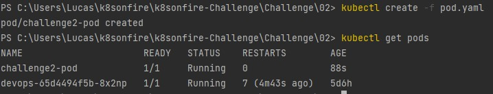
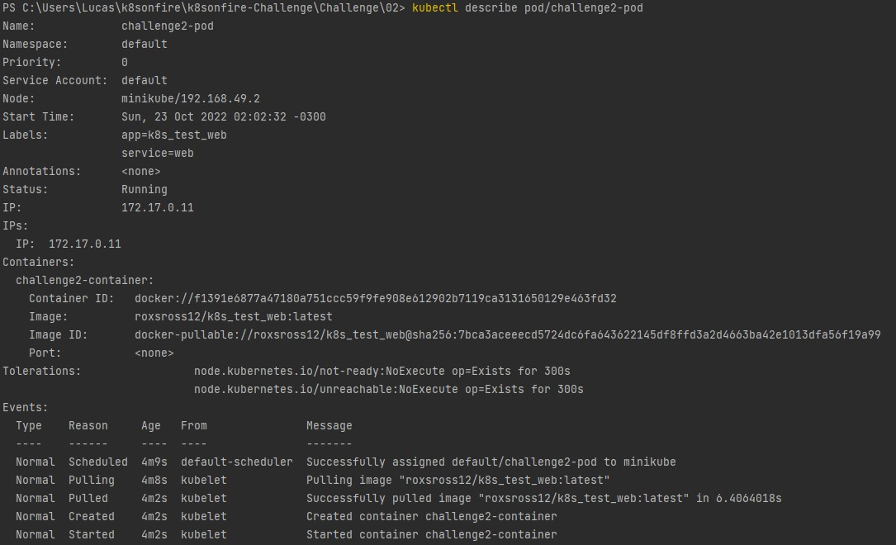
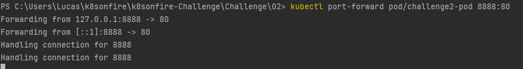
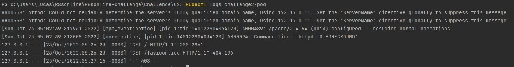

# CHALLENGE Nº 2

### 1. Archivo yaml que has creado con la definición del Pod.
* [pod.yaml](pod.yaml)
### 2. Imagen donde se comprueba que el Pod ha sido creado .

### 3. Imagen donde se ve la información detallada del Pod .

### 4. Imagen donde se ve el fichero `index.html` del DocumentRoot .
### 5. Imagen del navegador accediendo a la aplicación con el `port-forward` .

### 6. Imagen donde se ve los logs de acceso del Pod .
